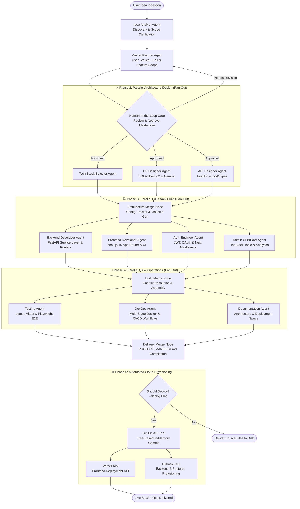
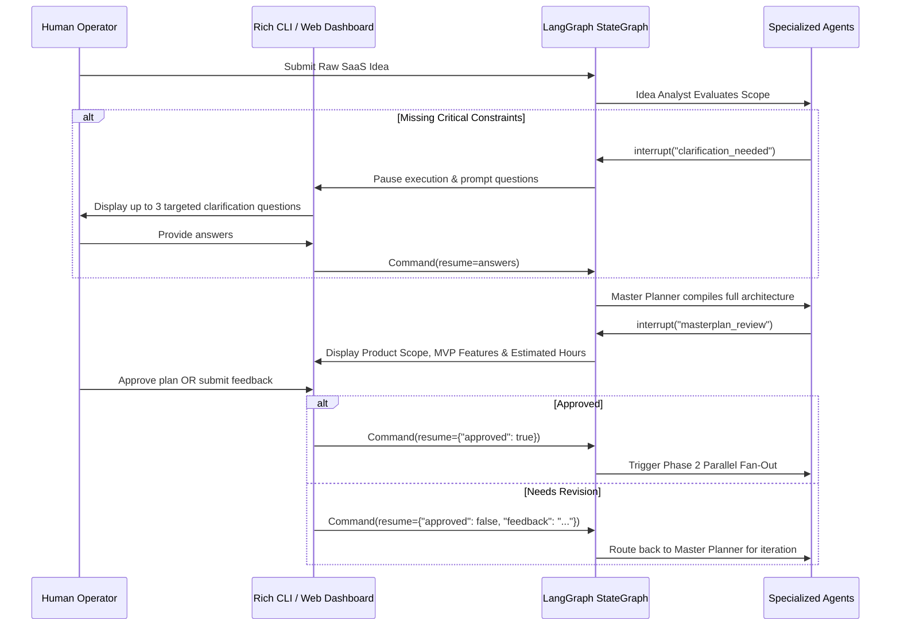

<div align="center">

# 🚀 Micro-SaaS Launchpad — Autonomous Software Factory
### 15-Agent LangGraph System Compiling Raw Ideas into Fully Deployed SaaS Products

[](https://python.org)
[](https://langchain-ai.github.io/langgraph/)
[](https://anthropic.com/)
[](https://nextjs.org/)
[](https://fastapi.tiangolo.com/)
[](#)

<p align="center">
  <a href="#-executive-summary">Executive Summary</a> •
  <a href="#-end-to-end-graph-topology">Graph Topology</a> •
  <a href="#-the-15-agent-specialization-catalog">Agent Catalog</a> •
  <a href="#-multi-tier-fan-out--fan-in-execution">Parallel Execution</a> •
  <a href="#-zero-binary-headless-cloud-deployment">Headless Deployment</a>
</p>

</div>

---

## 📌 Executive Summary

Building a software-as-a-service (SaaS) minimum viable product from scratch typically requires weeks of boilerplate configuration: designing database schemas, implementing JWT authentication, configuring Stripe webhooks, crafting admin dashboards, wiring API contracts, writing tests, and configuring CI/CD pipelines.

**Micro-SaaS Launchpad** is an autonomous **Meta-Agent Software Engineering Factory**. Orchestrated via **LangGraph 0.3** and powered by **Claude 3.5 Sonnet**, the platform accepts a single raw product idea (e.g., *"An invoicing tracker for freelancers with direct Stripe payment links"*) and compiles it into a production-grade, deployed SaaS application within minutes.

Rather than generating superficial single-file mockups, the system coordinates **15 specialized ReAct agents** across **three parallel Fan-Out/Fan-In build phases**, generating complete multi-file repositories (~3,000–8,000 lines of type-safe code), running test suites, and programmatically provisioning live cloud environments on **GitHub, Vercel, and Railway**.

---

## 🏛️ End-to-End Graph Topology

The system execution flow is modeled as a stateful, cyclical **Directed Acyclic Graph (DAG)** with deterministic conditional routing, checkpointer state recovery, and Human-in-the-Loop gates:



---

## 🧩 The 15-Agent Specialization Catalog

Every agent operates as a specialized worker node governed by strict Pydantic schemas, isolated system prompts, and explicit input/output contracts:

| Agent | Responsibility | Core Deliverables |
| :--- | :--- | :--- |
| **🎯 Orchestrator** | Global State Supervisor | State lifecycle management, error boundary routing, and retry budgets |
| **💡 Idea Analyst** | Ideation & Clarification | Structured problem statement, target persona definition, and competitor analysis |
| **🗺️ Master Planner** | Enterprise Architecture | Feature backlog (MVP vs. Phase 2), page routes inventory, and data schemas |
| **⚙️ Tech Stack** | Stack Selection & Config | Framework decisions, `pyproject.toml`, `package.json`, and environment definitions |
| **🗄️ DB Designer** | Database Architecture | Declarative SQLAlchemy 2 Mapped models, async Alembic migrations, and seed scripts |
| **🔌 API Designer** | Contract Engineering | REST endpoints, Pydantic v2 validation DTOs, TypeScript Zod types, and Axios client |
| **⚡ Backend Dev** | Business Logic | Domain service layers, pagination helpers, email workers, and Stripe webhook handlers |
| **🎨 Frontend Dev** | Next.js 15 Application | App Router pages, shadcn/ui components, TanStack Query hooks, and responsive UX |
| **🎭 UI/UX Designer** | Token System | Design tokens, color scales, `globals.css`, and Tailwind CSS typography presets |
| **🔐 Auth Engineer** | Security & RBAC | JWT access/refresh token rotation, bcrypt hashing, Next.js middleware, and OAuth |
| **🛡️ Admin UI** | Operations Dashboard | TanStack user tables, Recharts analytics metrics, and user suspension controls |
| **🔗 Integration** | Assembly & Consistency | Fan-In conflict resolver reconciling cross-agent import paths and shared state |
| **🧪 Testing** | Full-Stack QA Suite | pytest async tests, Vitest component mocks, and Playwright headless E2E specs |
| **🚀 DevOps** | Containerization & CI | Multi-stage Dockerfiles, GitHub Actions CI/CD, Railway toml, and Nginx reverse proxy |
| **📚 Documentation** | Technical Architecture | ARCHITECTURE.md (with Mermaid diagrams), DEPLOYMENT.md, and OpenAPI guides |

---

## ⚡ Multi-Tier Fan-Out / Fan-In Parallelism

Sequential code generation across 15 agents would result in prohibitive execution latencies (45–60 minutes). The Launchpad enforces **three distinct topological Fan-Out/Fan-In barriers**:

### 1. Phase 2 Design Fan-Out
`Tech Stack`, `DB Designer`, and `API Designer` execute simultaneously using independent sub-slices of the `LaunchpadState`. The `arch_merge` barrier aggregates models, routers, and dependencies into unified configuration manifests before code generation begins.

### 2. Phase 3 Code-Generation Fan-Out
The core build phase parallelizes four specialized developers:
$$\text{Build Phase} = \text{Parallel}(\text{Backend}, \text{Frontend}, \text{Auth}, \text{Admin})$$
This cuts code generation time by **75%**. The `build_merge` node applies strict conflict-resolution precedence rules (`auth_files > backend_files > admin_files > frontend_files`) to ensure zero import regressions.

### 3. Phase 4 Quality & Delivery Fan-Out
`Testing`, `DevOps`, and `Docs` run in parallel to wrap the validated codebase in test harnesses, multi-stage container builds, and deployment manifests before writing to disk.

---

## 🌐 Zero-Binary Headless Cloud Deployment

Most automated code generation tools require a local machine with pre-installed `git`, `docker`, and deployment CLIs. Micro-SaaS Launchpad features **native HTTP/GraphQL tool wrappers**:

### 1. In-Memory Git Tree API (`github_tool.py`)
Bypasses local `git` binaries entirely. Generates Git blobs, constructs tree manifests, commits revisions, and updates reference branches directly over the **GitHub REST API v3**. Handles large repositories seamlessly through chunked blob trees (batch sizes $\le 150$).

### 2. Automated Frontend Deployment (`vercel_tool.py`)
Communicates directly with the **Vercel REST API v13**, provisions the project, sets production environment variables, uploads file buffers in parallel, and polls deployment health until the live HTTPS URL is achieved.

### 3. Managed Infrastructure Provisioning (`railway_tool.py`)
Utilizes the **Railway GraphQL v2 API** to provision a PostgreSQL 16 cluster, deploy the FastAPI container from the newly created GitHub repository, inject database connection secrets, generate public domain names, and verify health check probes.


---


## 🛠️ Dual-Layer Enterprise Tech Stack

The platform operates across two distinct technology layers: the **Meta-Orchestrator Runtime** (the engine itself) and the **Generated Target Architecture** (the deployed micro-SaaS output).

| System Tier | Component | Technology & Implementation Details |
| :--- | :--- | :--- |
| **Meta Engine** | **Agent Orchestration** | **LangGraph 0.3** (`StateGraph`, `interrupt()`, `MemorySaver` / Redis checkpoints) |
| **Meta Engine** | **Primary Cognitive Model**| **Claude 3.5 Sonnet** (structured JSON outputs via `with_structured_output`) |
| **Meta Engine** | **CLI Terminal Interface** | **Rich** (colored markdown panels, live progress spinners, interactive tables) |
| **Meta Engine** | **State Contracts** | **Pydantic v2** (`LaunchpadState`, `MasterPlan`, `APIOutput`, `TechStack`) |
| **Meta Engine** | **Headless Deployers** | Custom async HTTP/GraphQL tools (`httpx`) for GitHub Tree, Vercel & Railway APIs |
| **Generated Output** | **Frontend Target** | **Next.js 15 (App Router)**, TypeScript, Tailwind CSS, shadcn/ui, TanStack Query |
| **Generated Output** | **Backend Target** | **FastAPI 0.115**, async SQLAlchemy 2, Alembic migrations, Pydantic v2 |
| **Generated Output** | **Database & Cache** | **PostgreSQL 16**, Redis 7 (task queue & caching) |
| **Generated Output** | **Auth & RBAC** | JWT (access/refresh tokens via `python-jose`), bcrypt password hashing |
| **Generated Output** | **Test Suites** | pytest (async backend), Vitest (frontend utils), Playwright (headless E2E) |

---

## 📂 Repository Topology

```text
micro-saas-launchpad/
├── launchpad/                        # Core Multi-Agent Orchestration Framework
│   ├── agents/                       # 15 Specialized Agent Nodes
│   │   ├── idea_analyst.py           # Problem extraction, clarification & competitor audit
│   │   ├── master_planner.py         # Complete masterplan generation & feature backlog
│   │   ├── tech_stack.py             # Technology selection & dependency generation
│   │   ├── db_designer.py            # SQLAlchemy 2 Mapped models & async Alembic setup
│   │   ├── api_designer.py           # FastAPI routers, Pydantic schemas & Zod definitions
│   │   ├── arch_merge.py             # Phase 2 Fan-In: Makefile, Dockerfile & CI pipeline assembly
│   │   ├── backend_dev.py            # Service layer, business logic, pagination & webhooks
│   │   ├── frontend_dev.py           # Next.js 15 App Router pages, layouts & shadcn components
│   │   ├── auth_engineer.py          # JWT rotation, rate limiting & route protection middleware
│   │   ├── admin_ui.py               # TanStack Table, Recharts analytics & user management
│   │   ├── build_merge.py            # Phase 3 Fan-In: Precedence-based conflict resolution
│   │   ├── testing_agent.py          # pytest-asyncio, Vitest & Playwright E2E test generators
│   │   ├── devops_agent.py           # Multi-stage Docker, Nginx SSL & GitHub Actions deployers
│   │   ├── docs_agent.py             # ARCHITECTURE.md (Mermaid), DEPLOYMENT.md & API specs
│   │   ├── delivery_merge.py         # Phase 4 Fan-In: PROJECT_MANIFEST.md compilation
│   │   └── deploy_agent.py           # Phase 5 Cloud Orchestration (GitHub, Vercel, Railway)
│   │
│   ├── graph/                        # State Machine Infrastructure
│   │   ├── graph.py                  # StateGraph compiler with conditional routing & retry loops
│   │   └── checkpointer.py           # Session checkpoint persistence (Memory / Redis)
│   │
│   ├── tools/                        # Programmatic Cloud Integrations
│   │   ├── github_tool.py            # In-memory Git Tree API committer (zero local git binary)
│   │   ├── vercel_tool.py            # Headless Vercel deployment & environment variable injector
│   │   ├── railway_tool.py           # Railway GraphQL project, Postgres & backend provisioner
│   │   └── web_search.py             # Perplexity / Tavily market research connector
│   │
│   ├── prompts/                      # Hardened System Prompts
│   │   └── system_prompts/           # Strict domain constraints for all 15 agents
│   │
│   └── schemas/                      # Pydantic v2 Type Definitions
│       ├── state.py                  # LaunchpadState monad & agent error structures
│       ├── idea.py                   # IdeaAnalysis schema contracts
│       ├── masterplan.py             # MasterPlan, Feature, and DataModel schemas
│       ├── architecture.py           # TechStack, DatabaseOutput & APIOutput definitions
│       └── build.py                  # AgentBuildOutput schema contracts
│
├── dashboard/                        # Next.js Real-Time Visualizer Client
│   ├── AgentRoster.tsx               # Active agent roster status indicators
│   ├── NodeGraphCanvas.tsx           # Interactive DAG execution canvas
│   ├── TerminalStream.tsx            # Live agent stdout & telemetry stream
│   └── PhaseStrip.tsx                # Macro-phase progress indicator
│
├── templates/                        # Validated Jinja2 boilerplate templates
├── main.py                           # Interactive CLI entry point with Rich terminal UI
├── MASTERPLAN.md                     # Architectural framework specification
├── pyproject.toml                    # Launchpad Python dependencies
└── docker-compose.yml                # Local testing environment
```

---

## ⚡ Quickstart & Execution Guide

### Prerequisites
* **Python 3.12+**
* **Anthropic API Key** (`ANTHROPIC_API_KEY`)
* *(Optional for Cloud Deployment)*: `GITHUB_TOKEN`, `VERCEL_TOKEN`, `RAILWAY_TOKEN`

---

### 1. Installation

```bash
# Clone repository
git clone https://github.com/your-username/micro-saas-launchpad.git
cd micro-saas-launchpad

# Create and activate virtual environment
python -m venv .venv
source .venv/bin/activate  # On Windows: .venv\Scripts\activate

# Install dependencies
pip install -r requirements.txt
```

---

### 2. Configure Environment Secrets

Create a `.env` file in the project root:

```env
# Required Cognitive Engine
ANTHROPIC_API_KEY="sk-ant-api03-..."

# Optional: Headless Cloud Deployment Credentials
GITHUB_TOKEN="ghp_..."
VERCEL_TOKEN="..."
RAILWAY_TOKEN="..."

# Optional: Output destination directory
LAUNCHPAD_OUTPUT_DIR="./generated_saas"
```

---

### 3. Execution Modes

#### Interactive Terminal Mode
Launches the interactive Rich terminal assistant, walking you through clarification questions:
```bash
python main.py
```

#### Direct Compilation to Disk
Synthesizes a complete SaaS codebase and saves it to a designated output directory:
```bash
python main.py "A subscription tracker for freelancers with auto-renewal alerts" --output ./my-saas
```

#### End-to-End Autonomous Cloud Deployment
Builds the product, pushes an in-memory commit to GitHub, deploys the frontend to Vercel, and provisions PostgreSQL + FastAPI on Railway:
```bash
python main.py "Invoice factoring marketplace for European agencies" --deploy --output ./my-saas
```

---

## ✋ Human-in-the-Loop (HITL) Checkpoints

To eliminate resource waste from misaligned prompts, the system integrates **two deterministic LangGraph interrupt gates**:



---

## 🖥️ Live Visualizer Dashboard (`/dashboard`)

Beyond the CLI, the engine includes a dedicated **React & Next.js Real-Time Visualizer**:
* **`NodeGraphCanvas.tsx`:** Renders live DAG node transitions, visually highlighting which agents are currently executing in parallel Fan-Out.
* **`TerminalStream.tsx`:** Streams raw token generation and agent logging directly to an embedded terminal viewport.
* **`AgentRoster.tsx`:** Displays real-time agent health, iteration budgets, and token usage metrics.
* **`PhaseStrip.tsx`:** Visualizes progress across the 5 macro-phases from Discovery to Cloud Delivery.

---

## 👨‍💻 Engineering & Systems Architecture

Architected by **Elvijs Landmans** ([landmansIT](https://landmansit.de)).

* **Meta-Agent Engineering:** Shifting beyond single-prompt toys to autonomous systems that design, write, test, and deploy software end-to-end.
* **Deterministic Parallelism:** Maximizing throughput via strict Fan-Out/Fan-In boundaries, cutting code generation latency by over 70%.
* **Zero-Binary Cloud Portability:** Abstracting developer tools into native HTTP/GraphQL API pipelines to run autonomous deployments without host machine dependencies.

---

## 📄 License

Proprietary Software. All Rights Reserved. Engineered for autonomous venture studios and rapid software prototyping.
